# 中期报告

## ViewMorphing

​		总体使用了MVVM框架设计开发。

### 技术难点

​		1、jenkins安装与部署

​		因为把服务器安装在Mac，所以使用homebrew较为方便的安装上了。因为以前没有学过计算机网络，所以这次知道了可以设置允许访问ip和监听端口后就可以让队员通过我的电脑内网ip加上端口号访问jenkins，感觉很神奇。但是之后因为网络的原因安装插件变得相当的麻烦，即使换了很多的镜像源也都不能解决问题，离线下载的hpi包也因为需要很多dependencies而不能安装上，最后是通过使用socks5代理服务器安装上了的。之后我们设置了webhook，有github push就会激发build，但是因为我电脑的ip会变（连校网），所以不是很方便，之后如果能部署到服务器上面就会好很多。build是通过先qmake得到makefile，再make得到可执行文件。

​	    2、摄像头实时捕获数据

​		光按照网上的opencv教程是不太够的，因为网上教程都直接使用死循环+imshow，这种方式来进行每一帧都显示。但这种方法显然无法利用到我们的QT，MVVM框架中。所以我就借用的计算机组成里面的知识，做了一个pulling操作，就是如果View中摄像头启动按钮按下了，那么view就会开启计时器，每固定间隔通过pulling操作从摄像头（Model维护）获取frame然后通过通知传递给VM，然后传递给view。

### 协作情况

​		整体项目使用了MVVM框架设计开发，将各部分分割开来，让大家各自完成各自的模块，并行开发，在写好基本架构之后，增加功能函数以及与之对应的command，完成绑定并实现功能后即可完成功能的添加，具有极高的可二次开发性。项目使用了`GitHub`和`jenkins`这一套工具来进行团队协作开发。

### 效果图

##### 初始界面

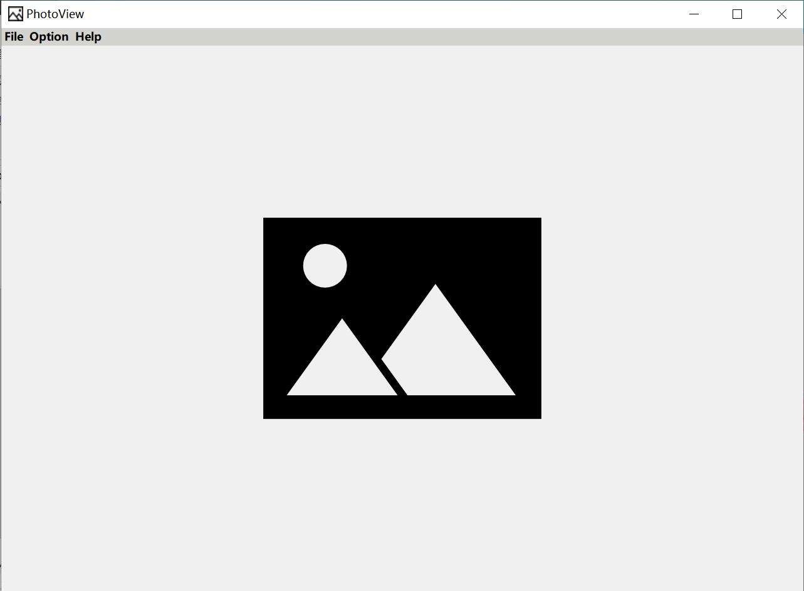

##### 打开图片

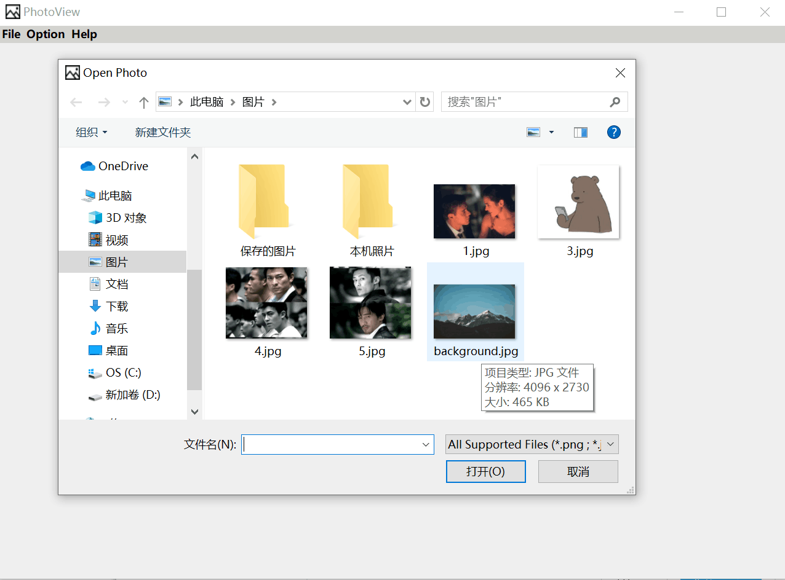

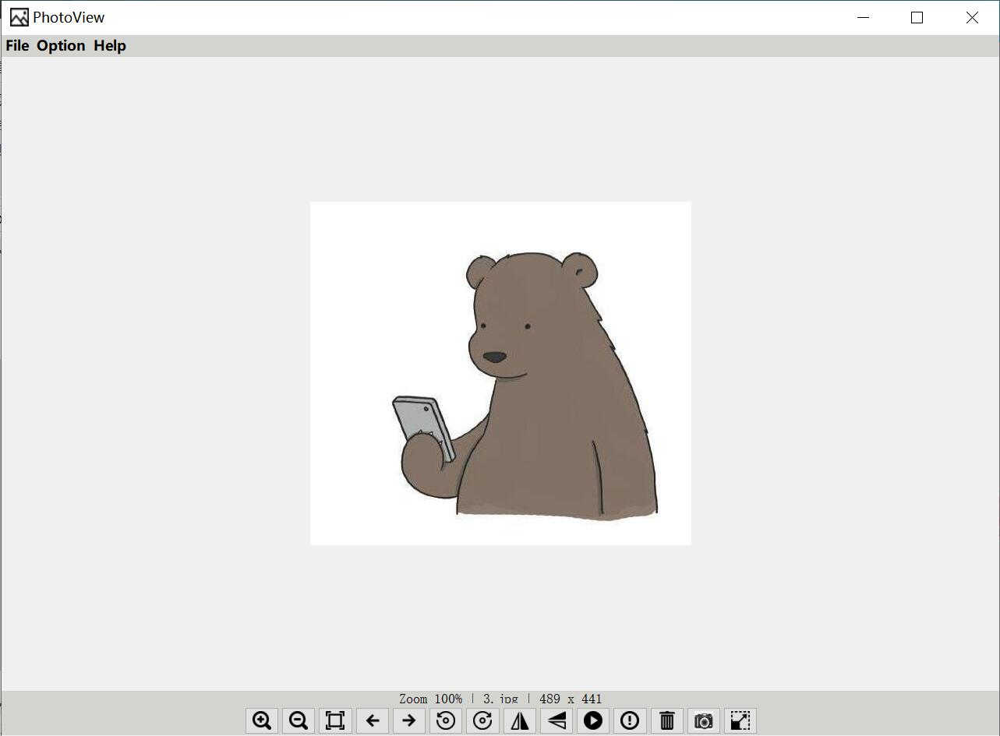

##### 图片信息

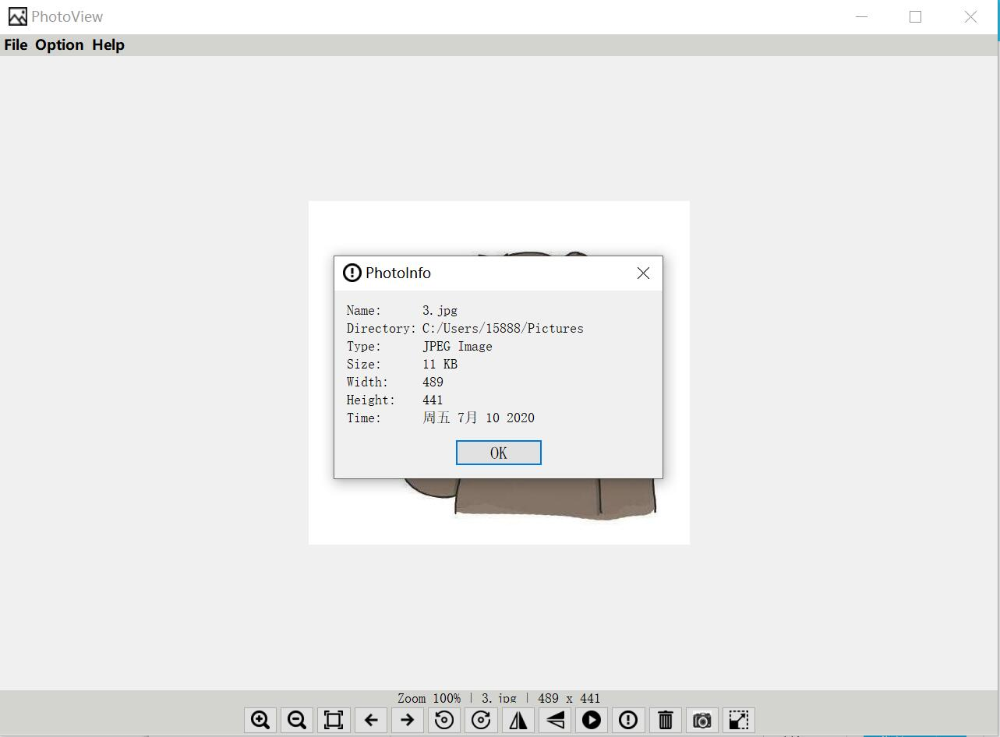

##### 幻灯片播放效果

##### 图片旋转

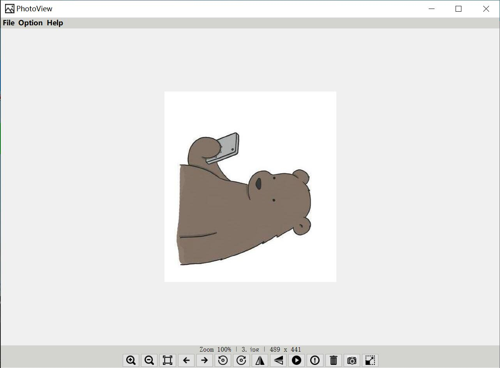

##### 图片翻转

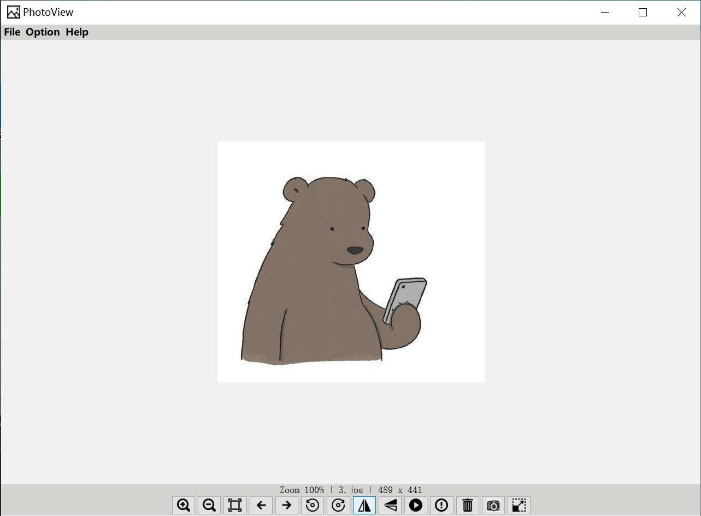

##### 图片放大

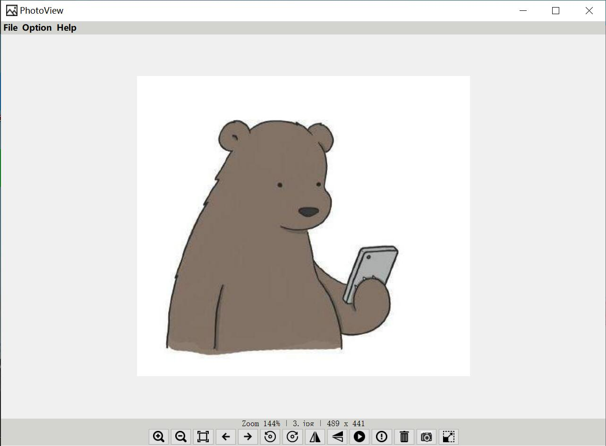

##### 图片缩小

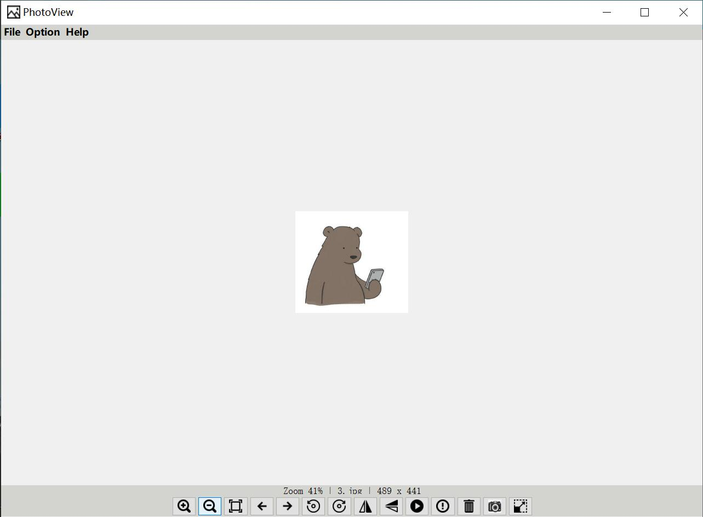

##### 打开摄像头

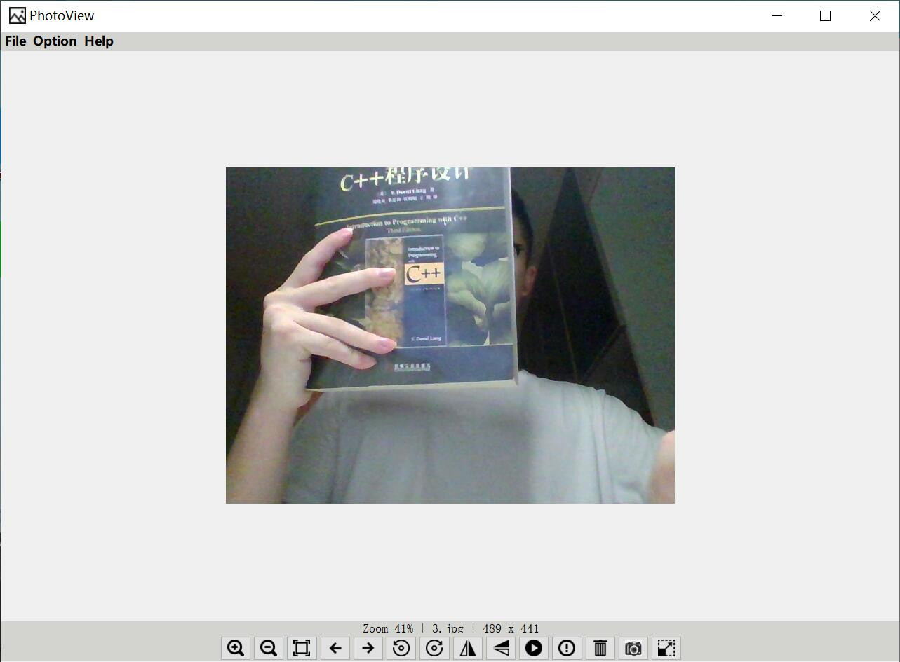

##### 拍照保存

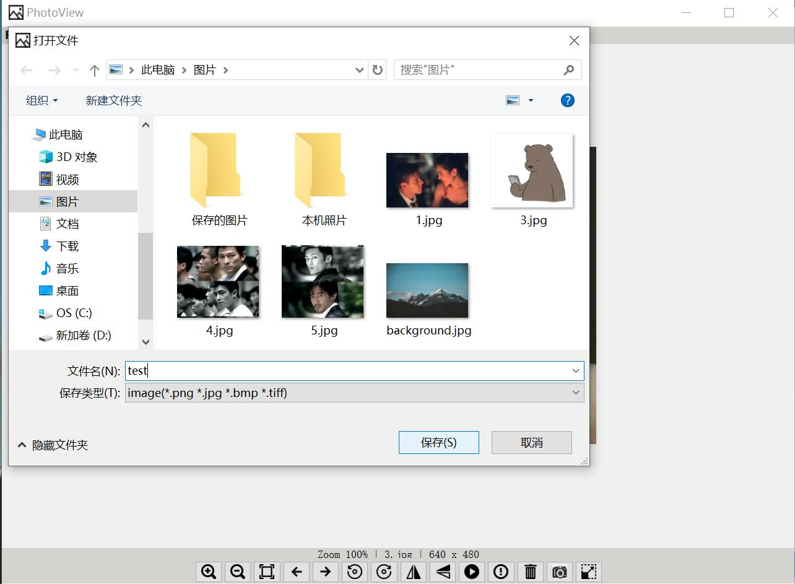

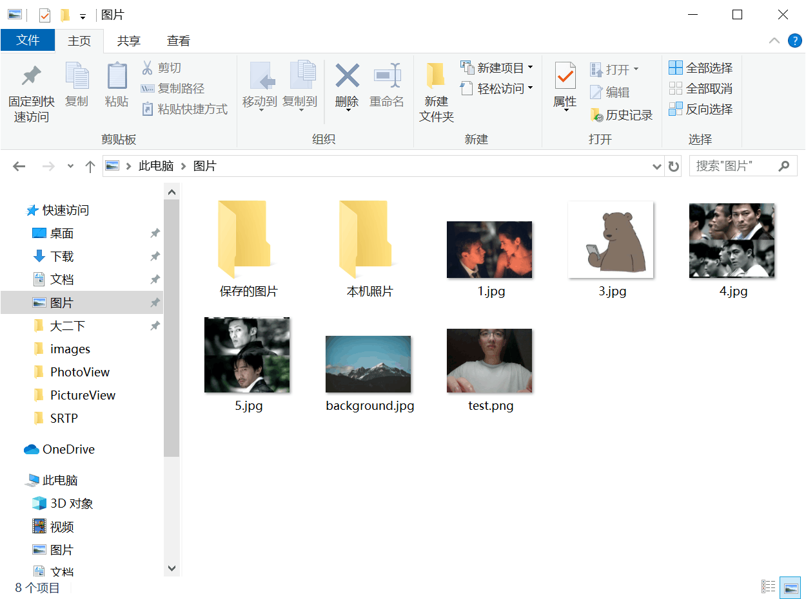

### 总体心得

​		在团队合作开发的过程中，我们经常会遇到各种过度耦合导致合作过程中会有部分工作相互等待的情况出现，这极大地增大了合作开发的难度，对整体集成也是一种挑战。但本课程中袁昕老师教授的MVVM框架很好的帮我们解决了这个问题。然后，在合作开发的过程中，我们使用了git与jenkins，这对于版本的控制和代码集成有很大的便利之处。更多详细心得见个人心得。

### 个人心得

- #### 朱紫涵

	在以前组队的时候，如果不是所有人都会用github的话，就需要每次打包好zip，然后发到qq群里面，有些时候连debug文件都没有删除掉，经常是一两个G，而且如果用vs那么Mac的同学就必须要装双系统或者虚拟机，非常的麻烦并且运行起来很卡。这次的小组开发就完全没有相关的问题，负责model的同学和负责view，viewmodel的同学都可以同时完成自己负责的模块，然后在merge的时候也几乎不会出现需要手工处理的地方，github让小组开发变得极其顺畅。因为使用了qt自带的qmake，还有生成的makefile，我们组两个Mac一个Windows系统在衔接的时候没有出现任何问题，完全不会出现以前必须用双系统或者虚拟机的情况。

- #### 聂俊哲

	

- #### 张琦

	​		在之前的所有课程的大作业中，我都遇到过各种小组合作开发过程中会因为一位同学的工作未完成导致另外的工作无法实现这样的过度耦合的情况，如在本学期的软件工程基础课程中，我们小组使用MVC框架进行web开发，就造成了合作时过度耦合，效率极低，并且在debug过程中耗费了大量的时间。

	​		在学习了本次C++项目管理和工程实践课程，并参与本次大作业开发后，我收获良多。我学习了MVVM框架，并在我们的大作业中进行了充足的实践，也体会到了MVVM框架为我们带来的并行开发的高效性。同时，我们在合作开发的过程中，利用了git与jenkins进行团队的开发以及持续集成，这也加深了我对团队开发的理解。

